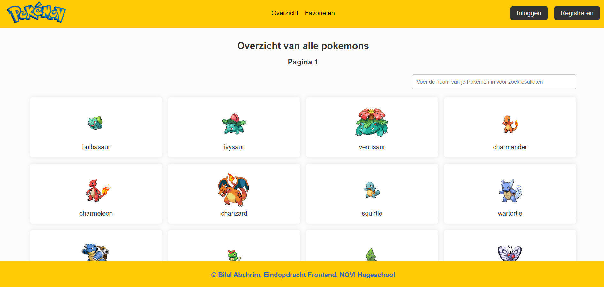
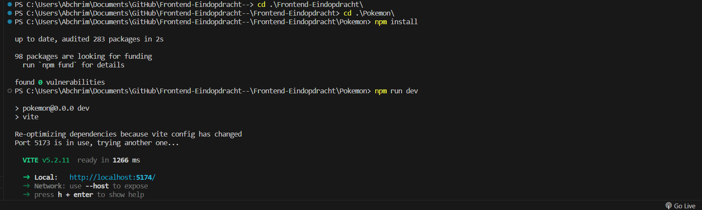

# Pokemon applicatie

# 1. Inleiding
De reden dat deze website tot stand is het volgende, ik wou een overzichtelijke en strakke manier voor het bekijken van pokemons. Daarvoor heb ik een eenvoudige tool waarmee je makkelijk pokemons kan opzoeken. De oplossing hiervoor is de tool die ik heb gemaakt, een overzicht van alle pokemons. Waarin je ook makkelijk een pokemon kan opzoeken door middel van de zoekfunctie. Daarnaast kan een gebruiker registreren als die daar behoefte aan heeft. Om vervolgens favorieten aan je account toe te kunnen voegen. De applicatie is ontwikkeld als eindopdracht voor de Frontend Leerlijn, op NOVI Hogeschool.

# 2. Screenshot

Link naar mijn project : https://github.com/Bilal2871/frontend-eindopdracht/tree/main

# 3. Benodigdheden 
Voor deze applicatie heb je een aantal dingen nodig om dit te kunnen laten werken. Om te beginnen kun je de link naar de Github Repository hier vinden. Daarnaast is er bij deze applicatie gebruik gemaakt van NOVI-backend om het inloggen en registreren te kunnen realiseren. De documentatie daarvoor kun je hier terug vinden. https://github.com/hogeschoolnovi/novi-educational-backend-documentation?tab=readme-ov-file#0-inloggen 

# 4. De applicatie draaien
Applicatie starten

Clone het project vanuit Git naar jouw lokale machine (gebruik een IDE naar keuze). Let op dat je bij het kopiëren van de link voor "SSH" kiest. Vergeet niet om Node.js & npm te installeren, omdat deze nodig zijn om de applicatie te draaien. Om de nieuwste versie te downloaden, voer je het volgende commando uit in je terminal:

npm install -g npm

Weet je niet zeker of je dit al hebt geïnstalleerd, of wil je weten welke versie je hebt? Gebruik dan de volgende commando's om dit te controleren:

node -v npm -v

Fijn: Nu kun je de benodigde packages uit de node_modules installeren. Dit doe je met het volgende commando:

npm install

Nu kun je de applicatie starten met het volgende commando:

npm run dev

Open http://localhost:5173/ om de pagina in je browser te bekijken. Voor elke keer als je een bestand opslaat, kun je deze wijzigingen hier terugzien. Gebruik ook de Devtools in je browser voor extra informatie.

# 5. Overige commando’s
Om verder te kunnen werken aan dit project en jouw werk op te slaan, is het belangrijk dat je eerst de huidige repository loskoppelt. Dit doe je met het volgende commando:

git remote remove origin
Vervolgens kun je op Git zelf een nieuwe respository aanmaken, deze koppelen aan jouw project. Werk je met meerdere mensen aan hetzelfde project? Dan is het verstandig om op een feature branch te werken. Deze kun je aanmaken met het volgende commando:

git checkout -b name-of-branch
Overige commando's die je veel zult gebruiken:

git init . om Git te initialiseren in jouw project. LET OP! Als je een project cloned gebeurd dit automatisch al.
git add . om alle wijzigen te stagen.
git status om de status van gestagede bestanden te zien.
git commit -m "description" om alle wijzigingen te committen en klaar te zetten voor de push.
git log om te zien welke commits er klaar staan voor de push.
git push origin name-of-branch om wijzigingen naar Git te pushen als je op een feature branch werkt.
git push origin main om wijzigingen naar Git te pushen als je op de main branch werkt.

# 6. BELANGRIJK VOOR BIJ HET RUNNEN VAN DE applicatie
image Op het moment dat je de ZIP uitpakt en opent in je editor. Is het wel belangrijk dat je eerst naar de juiste mappen gaat de stappen staan hieronder en dan pas de applicatie opstart.(Zelf getest en met bijbehorende screenshot moet dit dus werken).

cd .\Frontend-Eindopdracht\

cd .\Pokemon\

npm install

npm run dev
